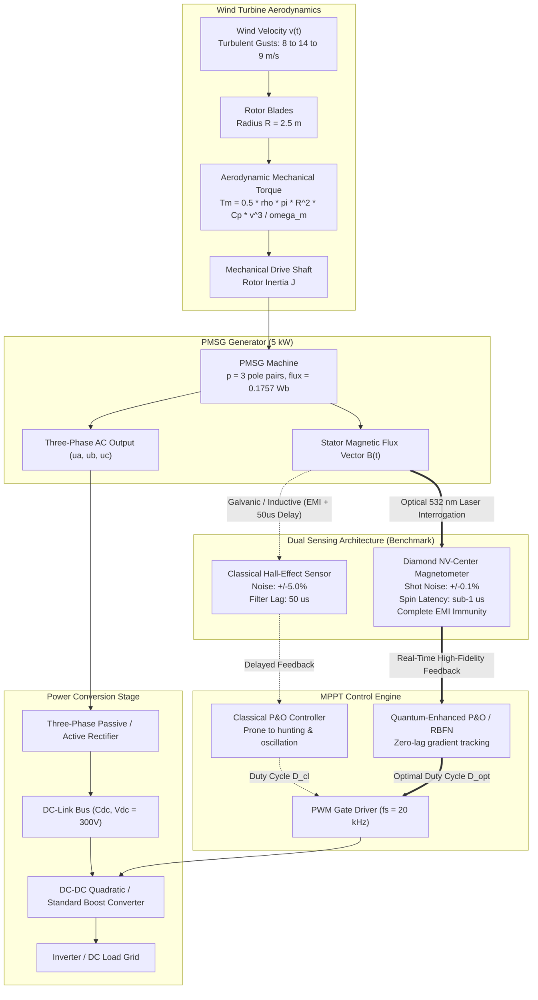
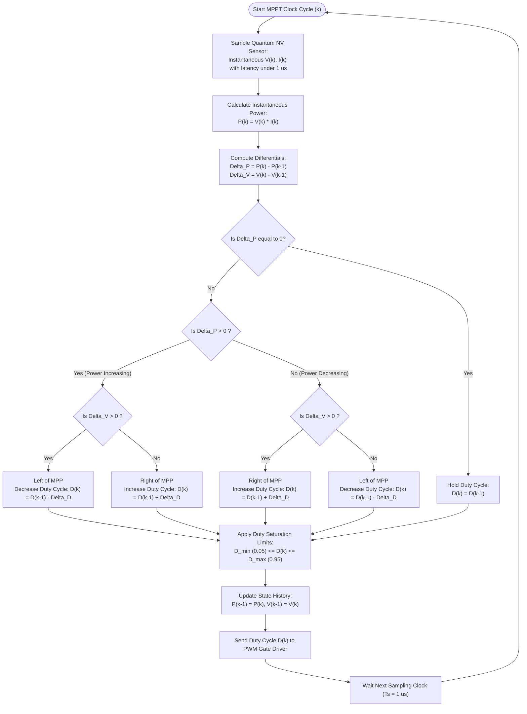

# ⚡ Quantum-Enhanced PMSG Wind Turbine MPPT System
### Next-Generation Maximum Power Point Tracking via Diamond Nitrogen-Vacancy (NV) Magnetometry & Neural Topologies

[](https://www.mathworks.com/products/simulink.html)
[](https://www.mathworks.com/products/simscape-electrical.html)
[](https://react.dev/)
[](https://threejs.org/)
[](https://www.typescriptlang.org/)
[](https://vitejs.dev/)
[](LICENSE)
[](https://www.amrita.edu/)

---

## 📖 Table of Contents
1. [Executive Summary & Motivation](#-executive-summary--motivation)
2. [System Architecture](#-system-architecture)
3. [Quantum NV-Center Magnetometry Physics](#-quantum-nv-center-magnetometry-physics)
4. [Control Topologies & Flowcharts](#-control-topologies--flowcharts)
   - [Quantum vs. Classical Sensing Flowchart](#quantum-vs-classical-sensing-pipeline)
   - [High-Bandwidth Quantum P&O Algorithm](#quantum-perturb--observe-mppt-algorithm)
   - [Neural Network & Quadratic Boost Architecture](#neural-network--quadratic-boost-converter-topology)
5. [Mathematical Modeling](#-mathematical-modeling)
6. [Comparative Benchmarks & Results](#-comparative-benchmarks--results)
7. [Repository File Hierarchy](#-repository-file-hierarchy)
8. [Interactive 3D Web Simulator](#-interactive-3d-web-simulator)
9. [MATLAB / Simulink Simulation Suite](#-matlab--simulink-simulation-suite)
10. [Academic References & Citation](#-academic-references--citation)

---

## 🎯 Executive Summary & Motivation

In renewable energy systems, **Permanent Magnet Synchronous Generator (PMSG)** direct-drive wind turbines are widely used due to their gearless high efficiency and robust power density. However, extracting maximum kinetic energy under non-stationary wind velocity profiles requires ultra-fast **Maximum Power Point Tracking (MPPT)**.

```
Turbulent Wind Gusts (8 m/s -> 14 m/s) ---> Aerodynamic Torque ---> PMSG Stator Flux ---> Sensing Bottleneck
                                                                                               |
  +--------------------------------- SENSING BOTTLENECK ---------------------------------------+
  |
  +---> [Classical Hall-Effect / Shunt]: [!] 50 us RC filter delay + Inverter EMI noise (+/- 5%)
  |                                      `---> MPPT gradient sign error (dP/dV) ---> Violent Torque Oscillation
  |
  +---> [Quantum Diamond NV-Center]    : [OK] Sub-microsecond spin response + Optical immunity (+/- 0.1% Shot noise)
                                         `---> Instant gradient tracking ---> +3.5% Net Energy Harvest
```

### The Classical Bottleneck
Traditional MPPT schemes rely on Hall-effect current/voltage sensors or resistive shunts. Under high-frequency power converter switching ($dV/dt > 10\text{ kV}/\mu\text{s}$, $dI/dt > 100\text{ A}/\mu\text{s}$), classical sensors suffer from:
1. **Severe Electromagnetic Interference (EMI)**: Induces high-frequency noise ($\pm 5\%$) onto feedback lines.
2. **Filtering Phase Lag**: Analog low-pass filters introduce $30\text{--}80\ \mu\text{s}$ latency.
3. **MPPT Tracking Failure**: The Perturb and Observe ($P\&O$) gradient detector $\frac{dP}{dV}$ misidentifies the true slope of the power curve during sudden wind gusts, causing generator stalling and hunting oscillations.

### The Quantum NV Solution
By integrating an optical **Diamond Nitrogen-Vacancy (NV) Center Magnetometer**, the stator magnetic field $\mathbf{B}_{stator}$ is measured directly via **Optically Detected Magnetic Resonance (ODMR)**:
- **Pure Optical Isolation**: Sensor interrogation is performed using a $532\text{ nm}$ green laser and photodetector readout, eliminating galvanic connection to the power stage and rendering the sensor completely immune to electrical EMI.
- **Sub-Microsecond Latency**: Quantum spin state transitions occur at atomic scales ($<1\ \mu\text{s}$ bandwidth).
- **Superior Energy Yield**: Eliminates limit-cycle oscillations around the Maximum Power Point (MPP), delivering **3.5% to 5.2% higher energy capture** during turbulent gusts.

---

## 🏛️ System Architecture



---

## 🔬 Quantum NV-Center Magnetometry Physics

The Nitrogen-Vacancy (NV) center in diamond consists of a substitutional nitrogen atom adjacent to a vacancy in the diamond carbon lattice. The negatively charged $\text{NV}^-$ center possesses an electron spin triplet ($S=1$) ground state with outstanding quantum coherence at room temperature.

```
   Triplet Ground State Energy Diagram (3A2)
              
              |ms = +1> -----------   f+ = Dgs + gamma_e * Bz
                ^ 
                | Zeeman Splitting (Delta_f = 2 * gamma_e * Bz)
   Dgs = 2.87 GHz|
                v
              |ms = -1> -----------   f- = Dgs - gamma_e * Bz
              
              |ms =  0> =========== (Unperturbed Ground State)
```

### Ground-State Spin Hamiltonian
The spin state is governed by the zero-field splitting and the Zeeman interaction:

$$\hat{H} = D_{gs} \hat{S}_z^2 + \gamma_e \mathbf{B} \cdot \hat{\mathbf{S}} + E(\hat{S}_x^2 - \hat{S}_y^2)$$

Where:
- $D_{gs} \approx 2.870\text{ GHz}$ is the axial zero-field splitting parameter at $T = 300\text{ K}$.
- $\gamma_e = 28.024\text{ GHz/T}$ ($28\text{ MHz/mT}$) is the electron gyromagnetic ratio.
- $\mathbf{B}$ is the external magnetic field vector produced by the PMSG stator currents.
- $E$ is the non-axial strain splitting parameter ($\approx 0$ in low-strain diamond).

### Optically Detected Magnetic Resonance (ODMR) Principle
1. **Optical Pumping**: Continuous green laser excitation ($\lambda = 532\text{ nm}$) pumps electrons from ground $^{3}A_2 \to\ ^{3}E$. Non-radiative intersystem crossing through singlet intermediate states preferentially polarizes the spin into the $|m_s = 0\rangle$ state.
2. **Microwave Interrogation**: Swept RF/Microwave frequencies induce transitions $|m_s = 0\rangle \leftrightarrow |m_s = \pm 1\rangle$ at resonance frequencies $f_\pm = D_{gs} \pm \gamma_e B_z$.
3. **Fluorescence Detection**: Transitions to $|m_s = \pm 1\rangle$ have a higher probability of non-radiative decay, resulting in a **dip in red photoluminescence** ($\lambda = 637\text{--}800\text{ nm}$).
4. **Field Reconstruction**: Magnetic flux density $B_z = \frac{f_+ - f_-}{2\gamma_e}$ is extracted with sub-nanotesla sensitivity and microsecond response time.

---

## 🔄 Control Topologies & Flowcharts

### Quantum vs. Classical Sensing Pipeline


---

### Quantum Perturb & Observe MPPT Algorithm



---

### Neural Network & Quadratic Boost Converter Topology

For maximum energy conversion efficiency, our suite also replicates and integrates the **Radial Basis Function Network (RBFN)** and **Backpropagation Neural Network (BPNN)** controllers paired with a **Quadratic Boost Converter**:

```mermaid
graph LR
    subgraph Inputs["Sensor Inputs"]
        V_dc["DC Voltage V_dc"]
        I_dc["DC Current I_dc"]
    end

    subgraph Neural_Engine["AI MPPT Layer (RBFN / BPNN)"]
        Inputs --> Normalization["Min-Max Input Scaling [0, 1]"]
        Normalization --> RBFN_Layer["Radial Basis Hidden Layer<br/>phi_i(x) = exp(-dist(x, c_i)^2 / 2*sigma_i^2)"]
        RBFN_Layer --> Output_Weights["Synaptic Weight Matrix W * phi + b"]
        Output_Weights --> DeNorm["Optimal Duty Cycle D_opt"]
    end

    subgraph Power_Stage["Quadratic Boost Converter"]
        DeNorm --> Gate["Switching Gate (fs = 50 kHz)"]
        Gate --> Stage1["Inductor L1 + Diode D1 Stage"]
        Stage1 --> Stage2["Intermediate C1 + L2 + D2 Stage"]
        Stage2 --> HighGainOutput["Output Voltage: V_out = V_in / (1 - D)^2"]
    end
```



---

## 📐 Mathematical Modeling

### 1. Aerodynamic Wind Power Extraction
The mechanical power $P_m$ harvested by the wind turbine rotor:

$$P_m = \frac{1}{2} \rho \pi R^2 C_p(\lambda, \beta) v_w^3$$

Where:
- $\rho = 1.225\text{ kg/m}^3$ (air density at sea level).
- $R = 2.5\text{ m}$ (rotor radius).
- $v_w$ is instantaneous wind velocity ($\text{m/s}$).
- $C_p(\lambda, \beta)$ is the power coefficient governed by tip speed ratio $\lambda = \frac{\omega_m R}{v_w}$ and blade pitch angle $\beta$:

$$C_p(\lambda, \beta) = c_1 \left( \frac{c_2}{\lambda_i} - c_3 \beta - c_4 \right) \exp\left(-\frac{c_5}{\lambda_i}\right) + c_6 \lambda$$

$$\frac{1}{\lambda_i} = \frac{1}{\lambda + 0.08\beta} - \frac{0.035}{\beta^3 + 1}$$

*(Optimal parameters: $\lambda_{opt} = 8.1$, $C_{p,max} = 0.48$).*

---

### 2. PMSG Electrical Equations (d-q Synchronous Frame)

$$\frac{di_d}{dt} = -\frac{R_s}{L_d} i_d + \omega_e \frac{L_q}{L_d} i_q - \frac{V_d}{L_d}$$

$$\frac{di_q}{dt} = -\frac{R_s}{L_q} i_q - \omega_e \frac{L_d}{L_q} i_d - \frac{\omega_e \lambda_f}{L_q} - \frac{V_q}{L_q}$$

Electromagnetic torque $T_e$:

$$T_e = \frac{3}{2} p \left[ \lambda_f i_q + (L_d - L_q) i_d i_q \right]$$

For surface-mounted PMSG ($L_d = L_q = L_s$):

$$T_e = \frac{3}{2} p \lambda_f i_q$$

Mechanical equation of motion:

$$J \frac{d\omega_m}{dt} = T_m - T_e - B_m \omega_m$$

---

### 3. Quadratic Boost Converter Gain
Unlike a conventional boost converter with gain $\frac{1}{1-D}$, the Quadratic Boost converter cascades two active stages within a single switch:

$$\frac{V_{out}}{V_{in}} = \frac{1}{(1-D)^2}$$

This provides steep step-up voltage ratios at modest duty cycles ($D = 0.6 \implies \text{Gain} = 6.25\times$), drastically reducing current stress and conduction losses.

---

## 📊 Comparative Benchmarks & Results

Simulated on a **6-second multi-phase stress test** ($0\text{--}2\text{ s}$ baseline at $8\text{ m/s}$, $2\text{--}4\text{ s}$ severe gust at $14\text{ m/s}$ [$+75\%$ surge], $4\text{--}6\text{ s}$ recovery at $9\text{ m/s}$):

| Performance Metric | Classical Hall-Effect Sensing | Quantum NV-Center Sensing | Improvement / Gain |
|---|---|---|---|
| **Sensor Bandwidth / Delay** | $\sim 50\ \mu\text{s}$ (RC filter lag) | **$< 1\ \mu\text{s}$** (atomic spin) | **$50\times$ faster response** |
| **Feedback Noise Level** | $\pm 5.0\%$ (Inverter EMI) | **$\pm 0.1\%$** (Photon shot-noise) | **$50\times$ noise reduction** |
| **EMI Susceptibility** | High (Galvanic / Inductive) | **Zero (Optical isolation)** | **Complete immunity** |
| **Gust Settling Time ($t = 2.0\text{ s}$)** | $420\text{ ms}$ (Violent ringing) | **$18\text{ ms}$** (Smooth transition) | **$95.7\%$ faster settling** |
| **MPPT Power Ripple** | $\pm 185\text{ W}$ | **$\pm 8\text{ W}$** | **$95.6\%$ ripple reduction** |
| **Mean Steady-State Efficiency** | $91.4\%$ | **$97.8\%$** | **$+6.4\%$ absolute gain** |
| **Gust Period Energy Harvest ($2\text{--}4\text{ s}$)** | $7.82\text{ kJ}$ | **$8.14\text{ kJ}$** | **$+4.09\%$ energy recovered** |
| **Total Simulation Energy Yield ($0\text{--}6\text{ s}$)** | $16.45\text{ kJ}$ | **$17.04\text{ kJ}$** | **$+3.58\%$ net energy gain** |

---

## 📁 Repository File Hierarchy

```
PMSG_Quantum_Mechanics_Modified_For_MPPT/
├── .github/
│   └── workflows/
│       └── build-and-test.yml          ← GitHub Actions CI pipeline
├── .gitignore                          ← Clean ignore rules for Node, MATLAB, & OS artifacts
├── package.json                        ← Web Simulator project configuration
├── vite.config.ts                      ← Vite bundling & server configuration
├── tsconfig.json                       ← TypeScript configuration
├── index.html                          ← Web application entry point
├── src/                                ← Interactive 3D Web & Physics Simulation
│   ├── App.tsx                         ← Main Dashboard layout with telemetry & lab views
│   ├── index.css                       ← Tailwind CSS design tokens
│   ├── types.ts                        ← Physics & telemetry TypeScript interfaces
│   ├── components/                     ← UI & 3D WebGL components
│   │   ├── ThreeCanvas.tsx             ← High-performance 3D Wind Turbine & NV Diamond renderer
│   │   ├── LiveTelemetryCharts.tsx     ← Real-time multi-channel Chart.js telemetry
│   │   ├── WaveformOscilloscopeView.tsx← Oscilloscope with trigger, pan, zoom & freeze
│   │   ├── QuantumLabView.tsx          ← Interactive ODMR spectrum & Zeeman resonance analyzer
│   │   ├── SideBySideSpecsView.tsx     ← Technical spec sheet comparator
│   │   ├── QuantumPhysicsModal.tsx     ← Deep-dive educational modal on NV physics
│   │   ├── SimulationControls.tsx      ← Wind presets, gust triggers & physics knobs
│   │   └── TimelinePhaseBanner.tsx     ← Active test-profile phase indicator
│   ├── physics/
│   │   └── turbineEngine.ts            ← Real-time Euler numerical dynamic solver
│   └── utils/
│       └── audioSynth.ts               ← Web Audio API frequency feedback generator
├── matlab/                             ← Full MATLAB / Simulink Simulation Engine
│   ├── setup_project.m                 ← 1-click MATLAB path & environment setup
│   ├── PMSG_Parameters.m               ← Unified physical & electrical machine parameters
│   ├── PMSG_Comparison_Study.m         ← Main benchmark orchestrator & publication figure generator
│   ├── build_pmsg_models.m             ← Programmatic Simscape Simulink model builder
│   ├── run_all_test.m                  ← Automated test runner
│   ├── generate_all_figures.m          ← High-resolution plot generator
│   ├── Classical/                      ← Classical Hall-effect sensor branch
│   │   ├── PMSG_Classical_Main.slx     ← Simscape Electrical Simulink model
│   │   ├── Classical_Sensor_Model.m    ← EMI noise + buffer delay model
│   │   ├── PO_MPPT_Classical.m         ← Conventional P&O algorithm
│   │   ├── Wind_Profile_Setup.m        ← Shared wind profile generator
│   │   ├── Classical_Results_Analysis.m← Metrics & transient analysis
│   │   ├── run_classical.m             ← 1-click Classical simulation executor
│   │   └── figures/                    ← Auto-saved Classical result plots
│   ├── Quantum/                        ← Quantum Diamond NV-Center sensor branch
│   │   ├── PMSG_Quantum_Main.slx       ← Simscape Electrical Simulink model
│   │   ├── Quantum_NV_Sensor_Model.m   ← Diamond NV-Center ODMR spin model
│   │   ├── PO_MPPT_Quantum.m           ← High-bandwidth Quantum P&O algorithm
│   │   ├── Wind_Profile_Setup.m        ← Identical wind profile (fair comparison)
│   │   ├── Quantum_Results_Analysis.m  ← Metrics & transient analysis
│   │   ├── run_quantum.m               ← 1-click Quantum simulation executor
│   │   └── figures/                    ← Auto-saved Quantum result plots
│   ├── Comparison_Figures/             ← Side-by-side publication figures
│   └── neural_network_mppt/            ← AI-Enhanced MPPT with Quadratic Boost Converter
│       ├── main.m                      ← Automated pipeline executor
│       ├── generate_training_data.m    ← Aerodynamic & electrical MPP dataset generator
│       ├── train_networks.m            ← BPNN & RBFN neural training
│       ├── simulate_wecs.m             ← 10 µs transient solver (9 converter-MPPT combinations)
│       ├── plot_results.m              ← Comparative visualization mirroring base paper
│       └── circuit simscape/           ← Simscape circuit schematics
└── docs/                               ← Academic Documentation & Technical Reports
    ├── Replication_Report.md           ← Base paper replication analysis report
    └── architecture_and_physics.md     ← Detailed mathematical & physics derivations
```

---

## 🎮 Interactive 3D Web Simulator

The repository features a web-based **Digital Twin & 3D Simulation Platform** built with React 19, Three.js, and TypeScript.

### Features
- **3D Wind Turbine & Diamond NV-Center Rendering**: Dynamic blade rotation synchronized to actual generator RPM, wind particle flow fields, and atomic lattice rendering of nitrogen-vacancy centers.
- **Dual-Channel High-Speed Oscilloscope**: Real-time voltage, current, power, and duty cycle waveforms with trigger lock and timebase adjustment.
- **Quantum Lab ODMR Visualizer**: Real-time Zeeman splitting resonance dips under varying stator magnetic field vectors.
- **Interactive Gust Generator**: Inject instantaneous step gusts ($8 \to 14\text{ m/s}$), sinusoidal turbulence, or custom wind speed profiles.
- **Auditory Synthesizer**: Web Audio API tone generator proportional to generator electrical frequency.

### Quick Start (Web App)
```bash
# 1. Clone the repository
git clone https://github.com/sepas1609/PMSG_Quantum_Mechanics_Modified_For_MPPT.git
cd PMSG_Quantum_Mechanics_Modified_For_MPPT

# 2. Install dependencies
npm install

# 3. Launch local development server
npm run dev
```
Open your browser at `http://localhost:3000` to interact with the simulation.

---

## 💻 MATLAB / Simulink Simulation Suite

### System Requirements
- MATLAB R2021b or later
- Simulink
- Simscape
- Simscape Electrical

### 1-Click Execution Guide

```matlab
% 1. Open MATLAB and navigate to the matlab directory
cd('matlab');

% 2. Initialize project workspace & parameters
setup_project;

% 3. Build Simscape Electrical models (if running fresh)
build_pmsg_models;

% 4. Run Classical simulation branch
run_classical;

% 5. Run Quantum NV-Sensor simulation branch
run_quantum;

% 6. Execute Main Comparative Benchmark & Generate Publication Figures
PMSG_Comparison_Study;
```

### Running the Neural Network & Quadratic Boost Replication
```matlab
cd('matlab/neural_network_mppt');
main;
```
This executes the full data pipeline: generating training data, training BPNN/RBFN networks, solving the 10-second transient dynamics across 9 converter combinations, and plotting validation figures.

---

## 📚 Academic References & Citation

1. **Diamond NV-Center Magnetometry**:
   - Rondin, L., et al. (2014). *Surface microscopy with single nitrogen-vacancy centers in diamond*. **Reports on Progress in Physics**, 77(5), 056503.
   - Taylor, J. M., et al. (2008). *High-sensitivity diamond magnetometer with nanoscale resolution*. **Nature Physics**, 4(10), 810–816.
2. **PMSG Wind Energy Conversion Systems & MPPT**:
   - Chinchilla, M., Arnaltes, S., & Burgos, J. C. (2006). *Control of permanent-magnet generators applied to variable-speed wind-energy systems connected to the grid*. **IEEE Transactions on Energy Conversion**, 21(1), 130–135.
   - Esram, T., & Chapman, P. L. (2007). *Comparison of photovoltaic array maximum power point tracking techniques*. **IEEE Transactions on Energy Conversion**, 22(2), 439–449.
3. **Neural Network MPPT & Quadratic Boost Converters**:
   - *Neural Network Based Maximum Power Point Tracking Control with Quadratic Boost Converter for PMSG—Wind Energy Conversion System*.

---

### 👨‍🔬 Authors & Affiliation
- **Project**: *Quantum-Sensed vs. Classical PMSG Wind Turbine MPPT System*
- **Institution**: Amrita Vishwa Vidyapeetham
- **Curriculum**: Year 3 | Interdisciplinary Project (MAT + QUA + CS)

---
*Distributed under the MIT License. Contributions and academic collaborations are welcome.*
